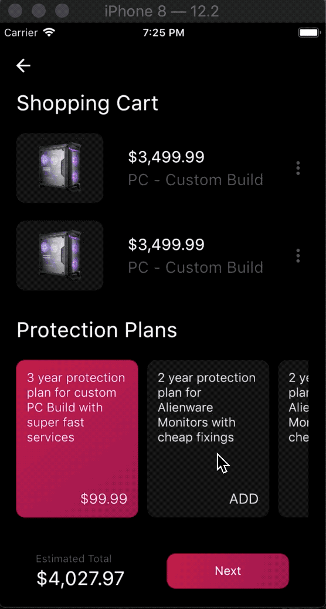
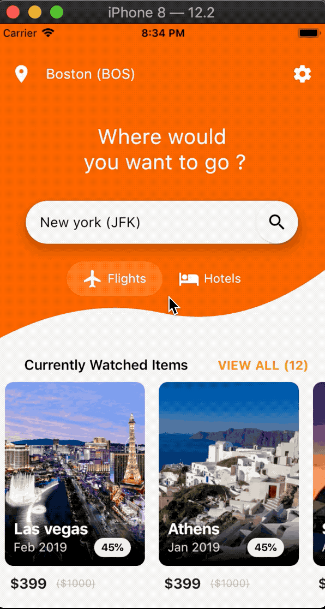
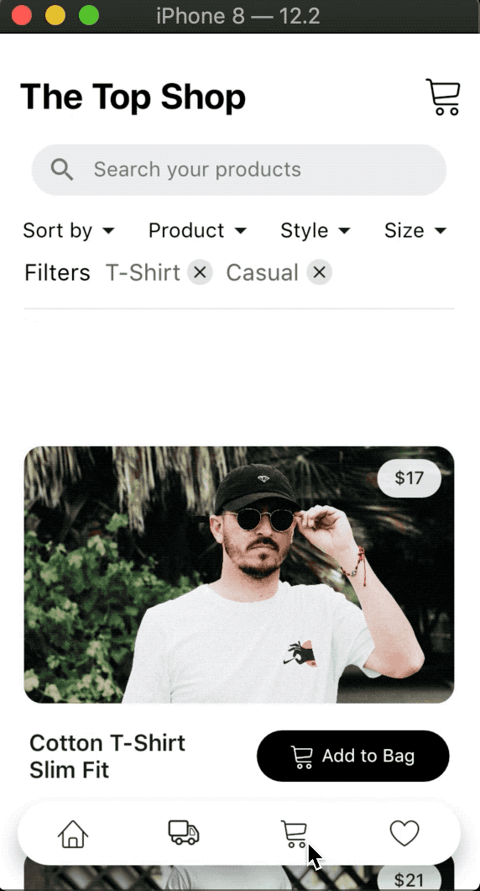
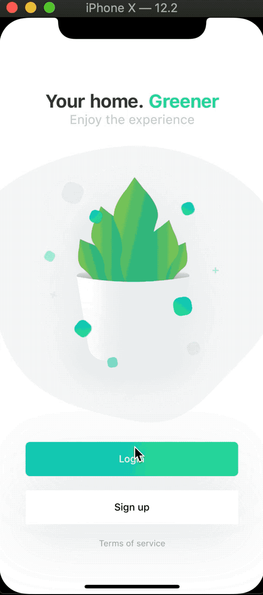
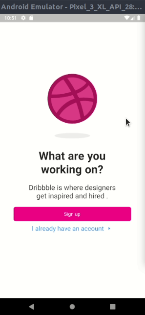

# Flutter UI apps
A collection of beautiful apps created using flutter , inpired by dribble or youtube UI projects . I will update this repository every single day / every 2 days , so star this repo in order to get updates !

> Please note that I am not commiting android and xcode builds . I have made no changes in those folders

All of the apps are listed as below

| Name             |             Link              |         Dribble / Youtube         |                       Preview                        |
| ---------------- | :---------------------------: | :-------------------------------: | :--------------------------------------------------: |
| Shopping cart UI | [git](https://bit.ly/2XFb1Zs) | [youtube](https://bit.ly/2NJpJyX) |  |
| Flightapp UI     | [git](https://bit.ly/2XGTsbk) | [dribble](https://bit.ly/30v9YgG) |      |
| Shopping cart UI | [git](https://bit.ly/32q3XmU) | [dribble](https://bit.ly/2Jvys3C) |  |
| News app UI      | [git](https://bit.ly/32seFcA) | [ui8](https://bit.ly/2JTdQRZ)     |       |
| Plant app UI      | [git](https://bit.ly/2LQ4JUC) | [dribble](https://bit.ly/2XMTymH)     |       |
| Wallpaper app UI      | [git](https://bit.ly/2qW2bvR) | Custom     |       |
| Dribble UI | [git](https://bit.ly/2P2eFeF) | [dribble](https://bit.ly/2Lwnuvl) |  |
| Magazine UI | [git](https://bit.ly/35eDutB) | [dribble](https://bit.ly/35eabaH) |  |

You can however download and use this projects . But in order to show support please consider <bold>starring</bold> this project .

# License
```
MIT License

Copyright (c) 2019 Adib Mohsin

Permission is hereby granted, free of charge, to any person obtaining a copy
of this software and associated documentation files (the "Software"), to deal
in the Software without restriction, including without limitation the rights
to use, copy, modify, merge, publish, distribute, sublicense, and/or sell
copies of the Software, and to permit persons to whom the Software is
furnished to do so, subject to the following conditions:

The above copyright notice and this permission notice shall be included in all
copies or substantial portions of the Software.

THE SOFTWARE IS PROVIDED "AS IS", WITHOUT WARRANTY OF ANY KIND, EXPRESS OR
IMPLIED, INCLUDING BUT NOT LIMITED TO THE WARRANTIES OF MERCHANTABILITY,
FITNESS FOR A PARTICULAR PURPOSE AND NONINFRINGEMENT. IN NO EVENT SHALL THE
AUTHORS OR COPYRIGHT HOLDERS BE LIABLE FOR ANY CLAIM, DAMAGES OR OTHER
LIABILITY, WHETHER IN AN ACTION OF CONTRACT, TORT OR OTHERWISE, ARISING FROM,
OUT OF OR IN CONNECTION WITH THE SOFTWARE OR THE USE OR OTHER DEALINGS IN THE
SOFTWARE.

```
